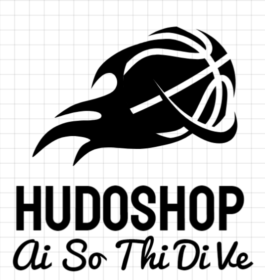

<p align="center">
  
</p>

# 🛍️ Web Bán Hàng Hudo


# 🛒 Web Bán Hàng - Dự Án Nhóm (PHP, HTML, CSS, JS, MySQL)

Chào mừng đến với dự án **Web Bán Hàng**, một hệ thống thương mại điện tử đơn giản được phát triển bởi nhóm sinh viên nhằm thực hành và áp dụng kiến thức lập trình web full-stack. Dự án được xây dựng dựa trên công nghệ phổ biến và tối ưu cho trải nghiệm người dùng hiện đại theo xu hướng năm 2025.

## 🚀 Tính Năng Nổi Bật

- ✅ Đăng ký / Đăng nhập người dùng (Bảo mật với mã hoá mật khẩu)
- 🛍️ Quản lý sản phẩm (CRUD sản phẩm, hình ảnh, mô tả, giá)
- 🛒 Giỏ hàng & Thanh toán (session-based cart)
- 📦 Quản lý đơn hàng (Admin & User)
- 🔍 Tìm kiếm sản phẩm theo tên, danh mục
- 📱 Giao diện responsive, tương thích mọi thiết bị
- 🌐 SEO cơ bản và tối ưu tốc độ tải trang
- 📊 Dashboard cho quản trị viên (quản lý người dùng, thống kê)

## 🧱 Công Nghệ Sử Dụng

| Công nghệ | Mô tả |
|----------|-------|
| **PHP** | Xử lý logic phía server |
| **MySQL** | Cơ sở dữ liệu quan hệ |
| **HTML5/CSS3** | Xây dựng giao diện người dùng |
| **JavaScript** | Tương tác động và hiệu ứng |
| **Bootstrap / Tailwind** _(tuỳ chọn)_ | Thiết kế responsive, hiện đại |

## 🔧 Kiến Trúc Dự Án

```bash
webbanhang/
│
├── index.php                # Trang chủ
├── /assets                  # Tài nguyên tĩnh (CSS, JS, ảnh)
├── /includes                # File cấu hình, kết nối DB, helper
├── /modules                 # Các module như sản phẩm, người dùng...
├── /admin                   # Giao diện quản trị
├── /user                    # Giao diện người dùng
└── README.md                # Mô tả dự án

## 🔖 Ghi chú tham khảo
Dự án này được phát triển dựa trên ý tưởng và giao diện của website [Tên Website] với mục đích học tập và thực hành.  
Mọi tài nguyên và mã nguồn đều được viết lại, chỉnh sửa và tối ưu hoá theo hướng cá nhân hoá và phù hợp với xu hướng năm 2025.

